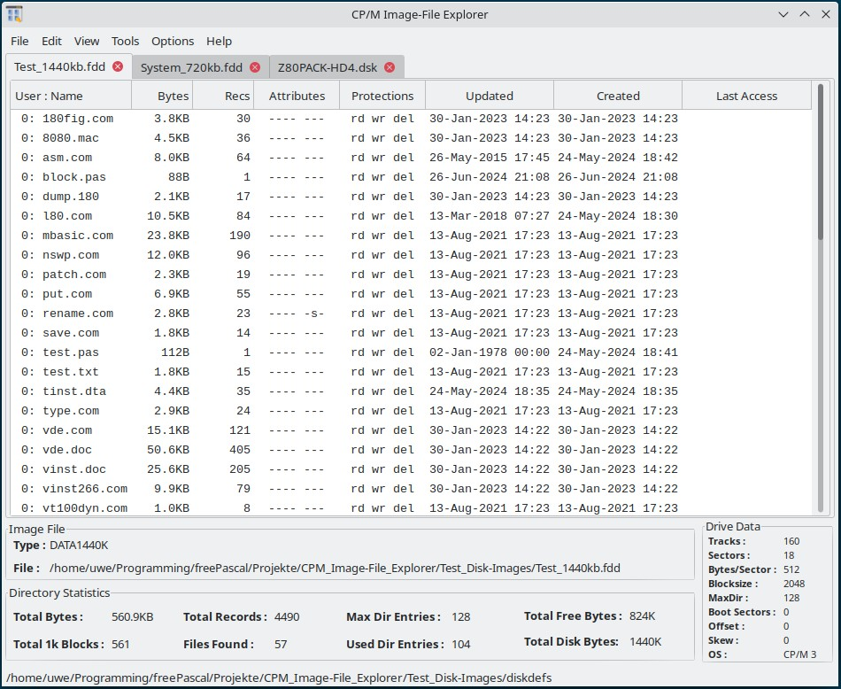

# CIFE (CP/M Image-File Explorer)

The CP/M Image-File Explorer is used to create and edit binary disk images such as those used by CP/M emulators.

The CP/M Image File Explorer is based on the C source code of Michael Haardt's CP/M tools.     
[http://www.moria.de/~michael/cpmtools](http://www.moria.de/~michael/cpmtools)

The HexEditor function is provided by the MPHexEditor component from Markus Stephany.     
[https://github.com/michalgw/mphexeditor](https://github.com/michalgw/mphexeditor)

CP/M Image-File Explorer is completely rewritten with the Lazarus Free Pascal development environment and replaces the previous C/C++ version with the wxWidgets framework.

The C code of the CP/M tools has also been completely converted to Pascal. At the same time, some small improvements / adjustments have been made.

CP/M Image-File Explorer can be compiled with a standard installation of the Lazarus/Free Pascal IDE. Third-party components used are generated at runtime and therefore do not need to be installed in the IDE.